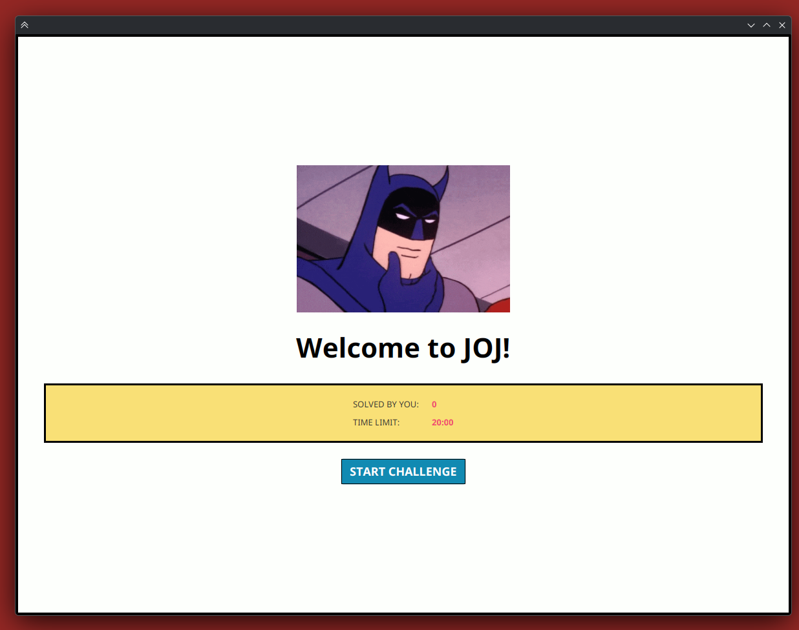
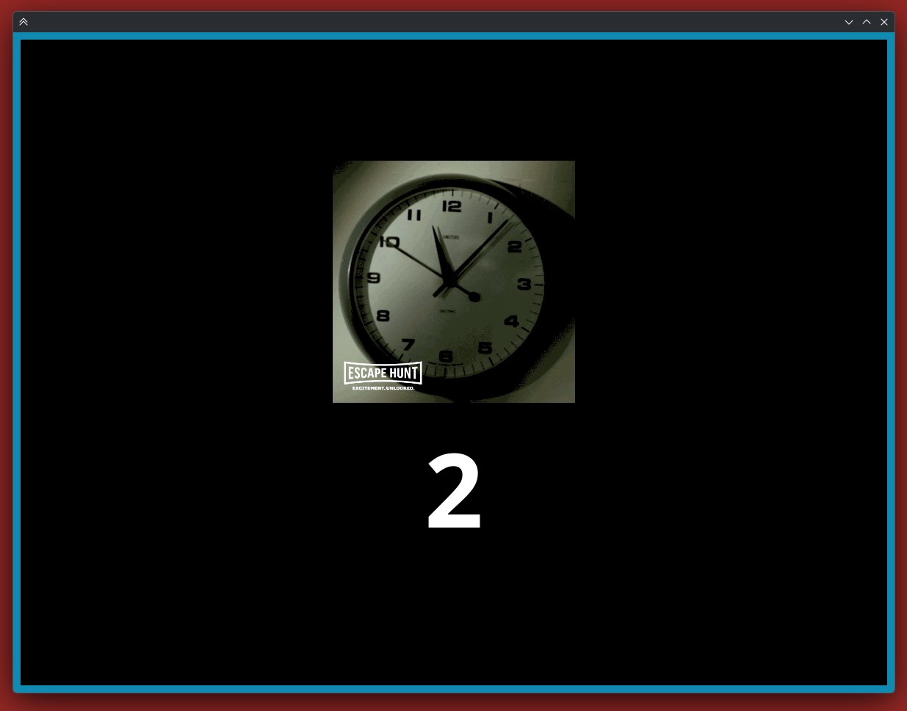
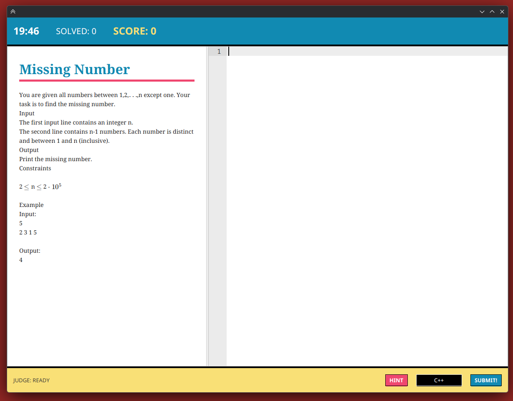
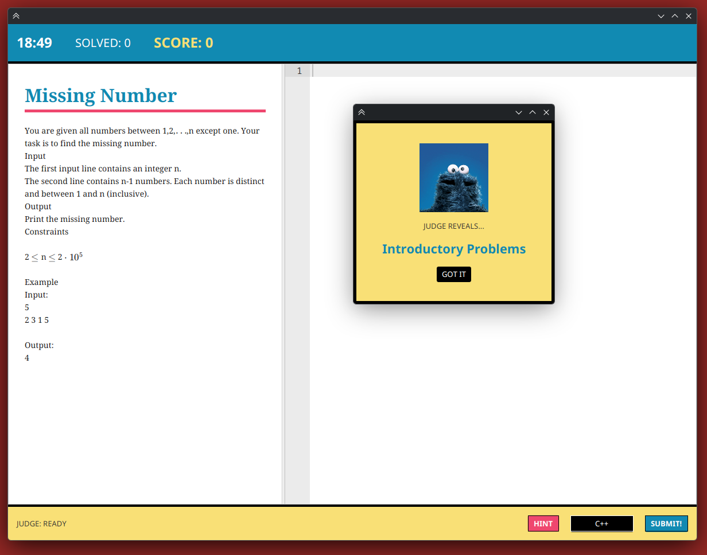
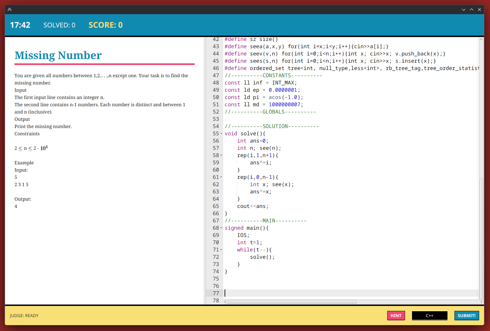
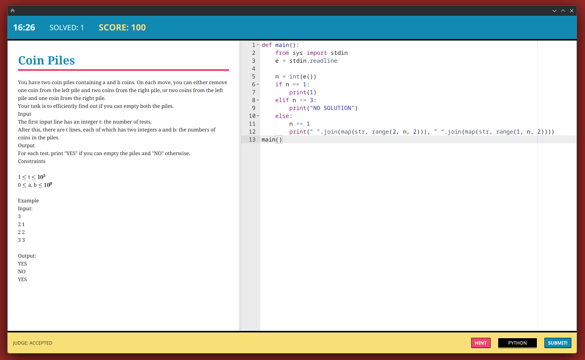
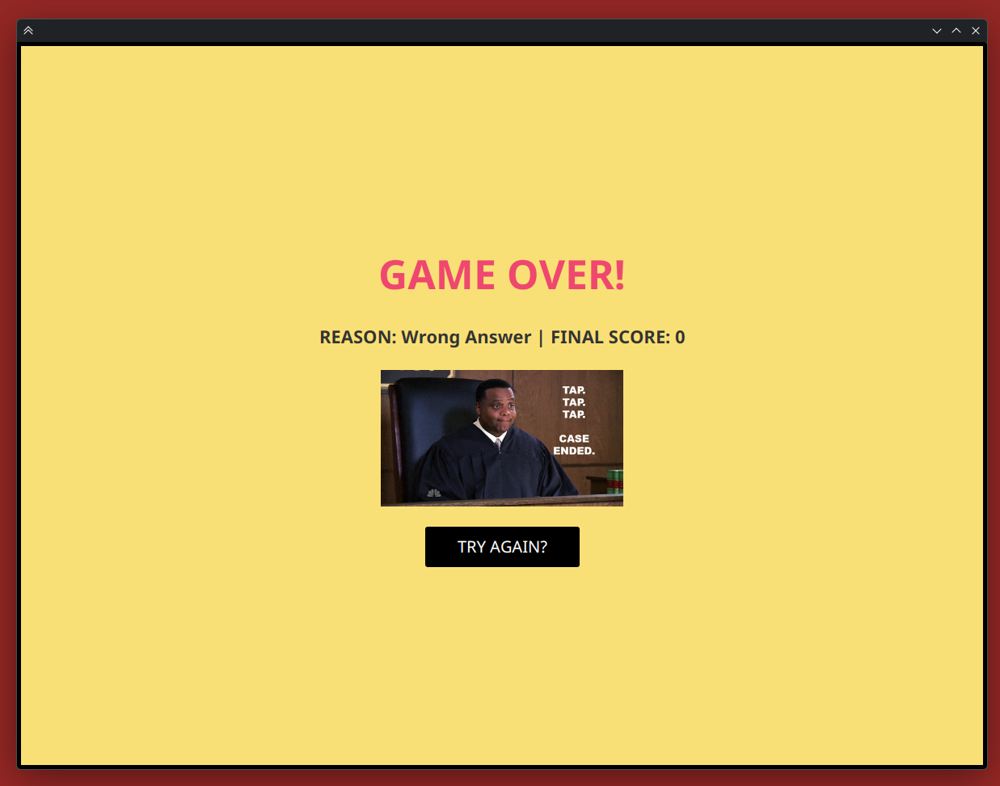

# 💥 JOJ2 — Competitive Programming Survival Judge

  <b>A high-octane, Pop-Art-styled desktop Online Judge and 20-minute survival challenge game.</b> 
  Test your algorithmic problem-solving speed under pressure with instant verdicts, live audio-visual feedback, and embedded code editing.

[Screenshots](#-screenshots--gameplay-flow) • [Key Features](#-key-features) • [Color Palette](#-pop-art-color-palette) • [Architecture](#-architecture--design-patterns) • [Project Report](#-project-report--documentation) • [Getting Started](#-getting-started)

---

## 📸 Screenshots & Gameplay Flow

### 1. The Welcome Lobby & Challenge Start
> Review your career stats (problems solved historically persisted in SQLite), get ready, and click **START CHALLENGE**.

  

---

### 2. The 3-Second Dramatic Countdown
> When the countdown strikes zero, the 20-minute survival timer begins and problems are randomly shuffled.

  

---

### 3. Problem Solving Arena
> Left pane displays the problem statement with MathJax LaTeX formatting. Right pane features the embedded Ace Editor with active line numbering and syntax styling.

  

---

### 4. Interactive Hint Modal
> Stuck on an algorithm? The Judge reveals the problem category (e.g. *Introductory Problems*, *Sorting and Searching*, *Dynamic Programming*).

  

---

### 5. Solving in C++ with Real-Time Highlighting
> Write and inspect high-performance C++ code directly inside the integrated editor.

  

---

### 6. Multi-Language Switch & Accepted Verdict
> Switch seamlessly to Python, submit your code, and receive instant feedback: `JUDGE: ACCEPTED` with `+100` score increment and victory audio fanfare!

  

---

### 7. Game Over Screen
> Run out of time or submit a Wrong Answer? Face the Judge with a breakdown of your final score and reason for termination.

  

---

## ✨ Key Features

- ⏱️ **20-Minute Survival Challenge**: Race against a ticking clock to solve algorithmic problems consecutively. Each accepted solution rewards `+100` score points.

- ⚡ **Multi-Language Judging Engine**:
  - **C++ (GCC/g++)**: Automatic compilation and execution with strict time and memory limits.
  - **Python 3**: Native execution with input/output pipe streaming.
  - **Verdict Lifecycle**: Real-time status updates (`ENQUEUED` ➔ `COMPILING` ➔ `TESTING` ➔ `ACCEPTED` / `WRONG ANSWER` / `TIME LIMIT EXCEEDED` / `RUNTIME ERROR` / `COMPILE ERROR`).

- 📝 **Embedded Ace Code Editor**: Integrated Monaco/Ace Editor via JavaFX WebView with full syntax highlighting, line numbers, and instant C++ / Python mode switching.

- 📐 **MathJax 3 Formula Rendering**: Problem statements render beautiful LaTeX formulas and mathematical constraints ($2 \le n \le 2 \cdot 10^5$) natively in HTML.

- 💡 **Judge Hints System**: Need a clue? Request a category hint revealed through comic pop-ups.

- 🔊 **Meme GIFs & Sound Effects**: Ticking clocks, victory bells (`you-win.mp3`), failure buzzers (`game-over.mp3`), and classic meme animations keep the adrenaline high.

- 🗄️ **Zero-Config Pre-Seeded Database**: Comes with a pre-seeded SQLite database (`joj.db.gz`, 25 MB) featuring curated CSES problems and test datasets, which **auto-decompresses** on first launch.

---

## 🎨 Pop-Art Color Palette

The interface is inspired by classic Pop Art & comic book aesthetics, featuring high-contrast borders, punchy saturated primaries, and retro visual accents:

| Swatch | Name | Hex Code | Role in UI |
| :---: | :--- | :--- | :--- |
|  | **Pop Yellow** | `#F9E076` | Stats display tables, hint modals, bottom control bar, score banners |
|  | **Pop Magenta** | `#EF476F` | Game-over titles, hint action buttons, problem statement title underline |
|  | **Pop Cyan** | `#118AB2` | Top arena status bar, countdown window border, submit button, problem headers |
|  | **Pop White** | `#FDFFFC` | Canvas background, workspace padding, and high-readability text |
|  | **Comic Black** | `#000000` | Heavy 3px–5px comic borders, secondary buttons, and countdown arena |

---

## 🏛️ Architecture & Design Patterns

The project follows clean object-oriented principles:
