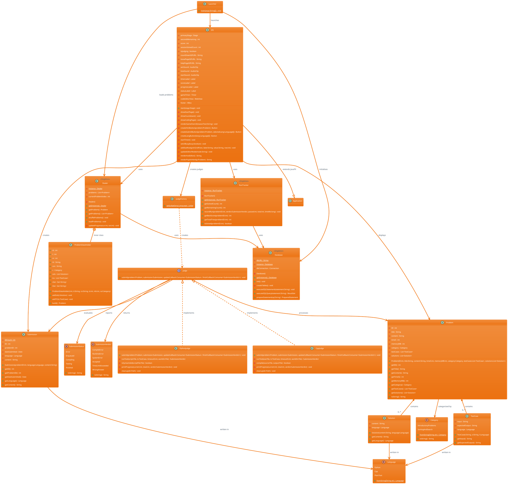

# JOJ2 System - PlantUML Class Diagram

## Key Features of this PlantUML Version:

### **1. Enhanced Visualization:**
- **Package Organization** - Logical grouping of related classes
- **Stereotypes** - `<<Singleton>>`, `<<interface>>` annotations
- **Color Coding** - Different colors for architectural layers
- **Notes** - Explanatory comments for key design patterns

### **2. Better UML Syntax:**
- **Proper visibility markers** - `+` public, `-` private, `{static}` static
- **Method parameters** - Full parameter lists with types
- **Relationship multiplicity** - `"0..*"` cardinalities
- **Interface implementation** - Proper `<|..` notation

### **3. Architectural Clarity:**
- **Layered packages** - Clear separation of concerns
- **Pattern highlighting** - Singleton, Factory, Strategy patterns
- **Dependency flow** - Clear data and control flow

### **4. Professional Appearance:**
- **AWS Orange theme** - Professional color scheme
- **Structured layout** - Logical flow from domain to application
- **Documentation notes** - Key architectural decisions explained

You can render this PlantUML diagram using:
- **Online**: PlantUML Web Server, PlantText.com
- **VS Code**: PlantUML extension
- **IntelliJ/Eclipse**: PlantUML plugins
- **Command line**: PlantUML JAR file

This version provides a more detailed and professionally structured view of your JOJ2 system architecture!
