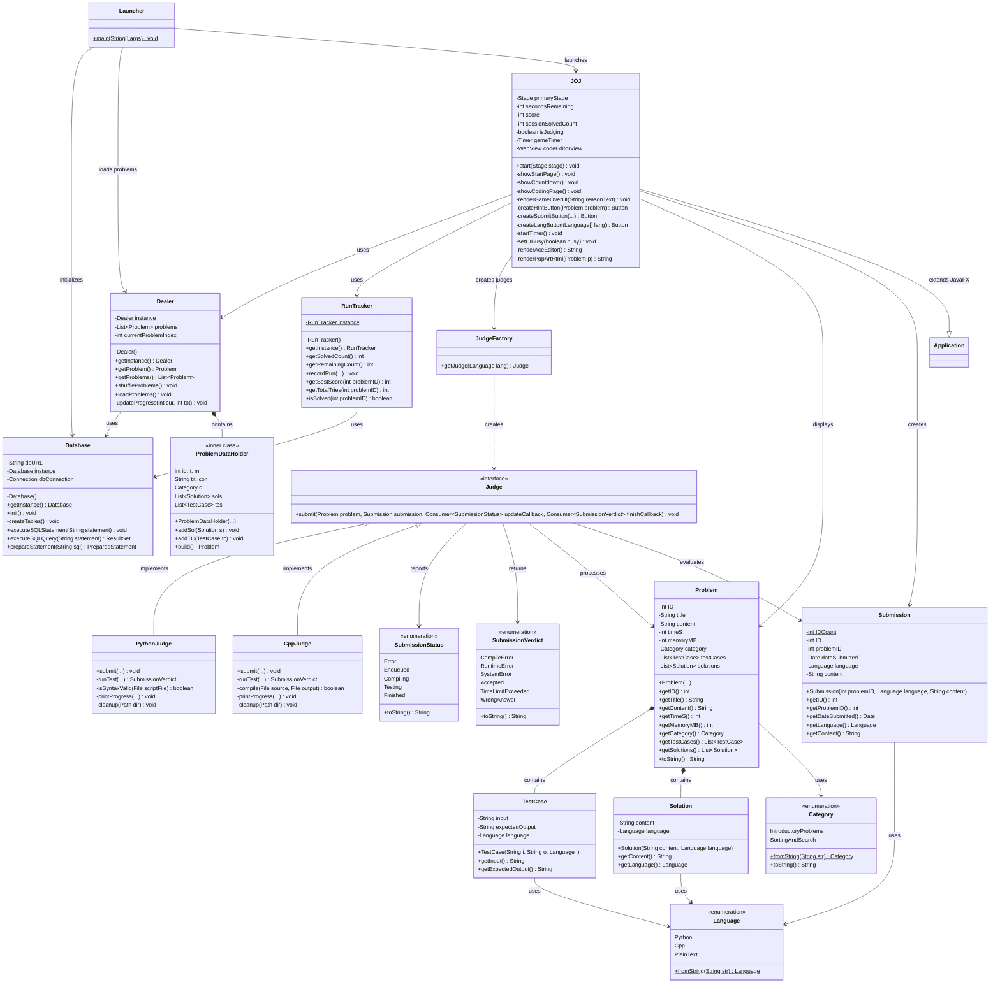

# JOJ2 System - Mermaid.js UML Class Diagram

```mermaid
classDiagram
    %% ==============================
    %% ENUMERATIONS (Top Level)
    %% ==============================
    %% ==============================
    %% ENUMERATIONS (Top Level)
    %% ==============================
    
    class Language {
        <<enumeration>>
        Python
        Cpp
        PlainText
        +fromString(String str)$ Language
    }

    class Category {
        <<enumeration>>
        IntroductoryProblems
        SortingAndSearch
        +fromString(String str)$ Category
        +toString() String
    }

    class SubmissionStatus {
        <<enumeration>>
        Error
        Enqueued
        Compiling
        Testing
        Finished
        +toString() String
    }

    class SubmissionVerdict {
        <<enumeration>>
        CompileError
        RuntimeError
        SystemError
        Accepted
        TimeLimitExceeded
        WrongAnswer
        +toString() String
    }

    %% ==============================
    %% CORE DOMAIN CLASSES
    %% ==============================
    %% ==============================
    %% CORE DOMAIN CLASSES
    %% ==============================

    class Problem {
        -int ID
        -String title
        -String content
        -int timeS
        -int memoryMB
        -Category category
        -List~TestCase~ testCases
        -List~Solution~ solutions
        +Problem(...)
        +getID() int
        +getTitle() String
        +getContent() String
        +getTimeS() int
        +getMemoryMB() int
        +getCategory() Category
        +getTestCases() List~TestCase~
        +getSolutions() List~Solution~
        +toString() String
    }

    class TestCase {
        -String input
        -String expectedOutput
        -Language language
        +TestCase(String i, String o, Language l)
        +getInput() String
        +getExpectedOutput() String
    }

    class Solution {
        -String content
        -Language language
        +Solution(String content, Language language)
        +getContent() String
        +getLanguage() Language
    }

    class Submission {
        -int IDCount$
        -int ID
        -int problemID
        -Date dateSubmitted
        -Language language
        -String content
        +Submission(int problemID, Language language, String content)
        +getID() int
        +getProblemID() int
        +getDateSubmitted() Date
        +getLanguage() Language
        +getContent() String
    }

    %% ==============================
    %% INFRASTRUCTURE SINGLETONS
    %% ==============================
    %% ==============================
    %% INFRASTRUCTURE SINGLETONS
    %% ==============================

    class Database {
        -String dbURL$
        -Database instance$
        -Connection dbConnection
        -Database()
        +getInstance()$ Database
        +init() void
        -createTables() void
        +executeSQLStatement(String statement) void
        +executeSQLQuery(String statement) ResultSet
        +prepareStatement(String sql) PreparedStatement
    }

    class Dealer {
        -Dealer instance$
        -List~Problem~ problems
        -int currentProblemIndex
        -Dealer()
        +getInstance()$ Dealer
        +getProblem() Problem
        +getProblems() List~Problem~
        +shuffleProblems() void
        +loadProblems() void
        -updateProgress(int cur, int tot) void
    }

    class RunTracker {
        -RunTracker instance$
        -RunTracker()
        +getInstance()$ RunTracker
        +getSolvedCount() int
        +getRemainingCount() int
        +recordRun(...) void
        +getBestScore(int problemID) int
        +getTotalTries(int problemID) int
        +isSolved(int problemID) boolean
    }

    %% ==============================
    %% JUDGE PATTERN
    %% ==============================
    %% ==============================
    %% JUDGE PATTERN
    %% ==============================

    class Judge {
        <<interface>>
        +submit(Problem problem, Submission submission, Consumer~SubmissionStatus~ updateCallback, Consumer~SubmissionVerdict~ finishCallback) void
    }

    class JudgeFactory {
        +getJudge(Language lang)$ Judge
    }

    class PythonJudge {
        +submit(...) void
        -runTest(...) SubmissionVerdict
        -isSyntaxValid(File scriptFile) boolean
        -printProgress(...) void
        -cleanup(Path dir) void
    }

    class CppJudge {
        +submit(...) void
        -runTest(...) SubmissionVerdict
        -compile(File source, File output) boolean
        -printProgress(...) void
        -cleanup(Path dir) void
    }

    %% ==============================
    %% UI APPLICATION LAYER
    %% ==============================

    class JOJ {
        -Stage primaryStage
        -int secondsRemaining
        -int score
        -int sessionSolvedCount
        -boolean isJudging
        -Timer gameTimer
        -WebView codeEditorView
        +start(Stage stage) void
        -showStartPage() void
        -showCountdown() void
        -showCodingPage() void
        -renderGameOverUI(String reasonText) void
        -createHintButton(Problem problem) Button
        -createSubmitButton(...) Button
        -createLangButton(Language[] lang) Button
        -startTimer() void
        -setUIBusy(boolean busy) void
        -renderAceEditor() String
        -renderPopArtHtml(Problem p) String
    }

    class Launcher {
        +main(String[] args)$ void
    }

    %% ==============================
    %% INNER HELPER CLASSES
    %% ==============================

    class ProblemDataHolder {
        <<inner class>>
        int id, t, m
        String tit, con
        Category c
        List~Solution~ sols
        List~TestCase~ tcs
        +ProblemDataHolder(...)
        +addSol(Solution s) void
        +addTC(TestCase tc) void
        +build() Problem
    }

    %% ==============================
    %% RELATIONSHIPS
    %% ==============================

    %% Core Domain Relationships
    Problem *-- TestCase : contains
    Problem *-- Solution : contains
    Problem --> Category : uses
    TestCase --> Language : uses
    Solution --> Language : uses
    Submission --> Language : uses

    %% Judge Pattern
    Judge <|-- PythonJudge : implements
    Judge <|-- CppJudge : implements
    JudgeFactory ..> Judge : creates
    Judge --> SubmissionStatus : reports
    Judge --> SubmissionVerdict : returns

    %% Singleton Usage
    Dealer --> Database : uses
    RunTracker --> Database : uses
    JOJ --> Dealer : uses
    JOJ --> RunTracker : uses
    
    %% Application Flow
    Launcher --> Database : initializes
    Launcher --> Dealer : loads problems
    Launcher --> JOJ : launches
    
    %% Operational Dependencies
    JOJ --> JudgeFactory : creates judges
    JOJ --> Problem : displays
    JOJ --> Submission : creates
    Judge --> Problem : processes
    Judge --> Submission : evaluates
    Dealer *-- ProblemDataHolder : contains

    %% External Dependencies
    JOJ --|> Application : extends JavaFX
```
